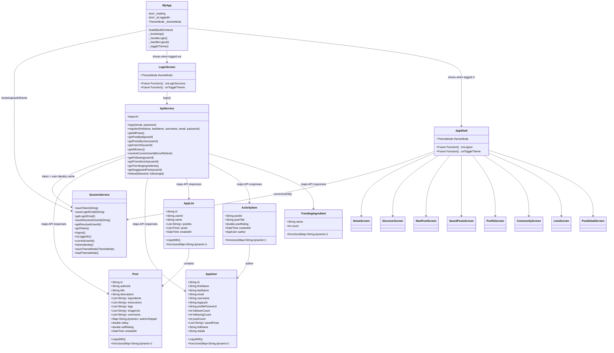
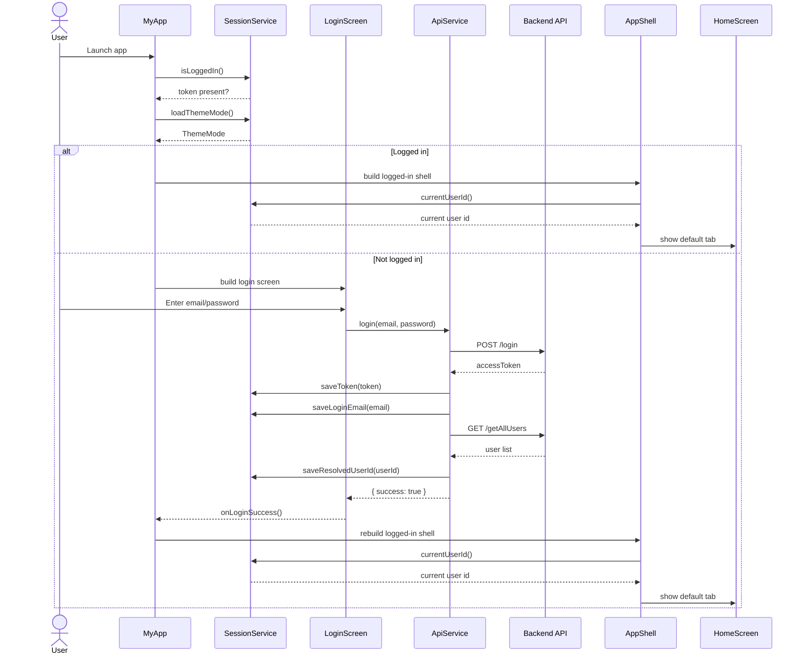

# BreadBoxd Architecture Diagrams

These diagrams reflect the current Flutter app structure in `lib/`.

## Class Diagram

## Sequence Diagram

This sequence shows the main startup and login flow that leads into the tabbed app shell.

## Notes

- The app uses `MyApp` as the stateful root that decides between `LoginScreen` and `AppShell`.
- `SessionService` is the local persistence layer for token, resolved user id, login email, and theme mode.
- `ApiService` is a static service layer that talks directly to the backend and maps responses into app models.
- `AppShell` is the navigation hub for the authenticated experience.
